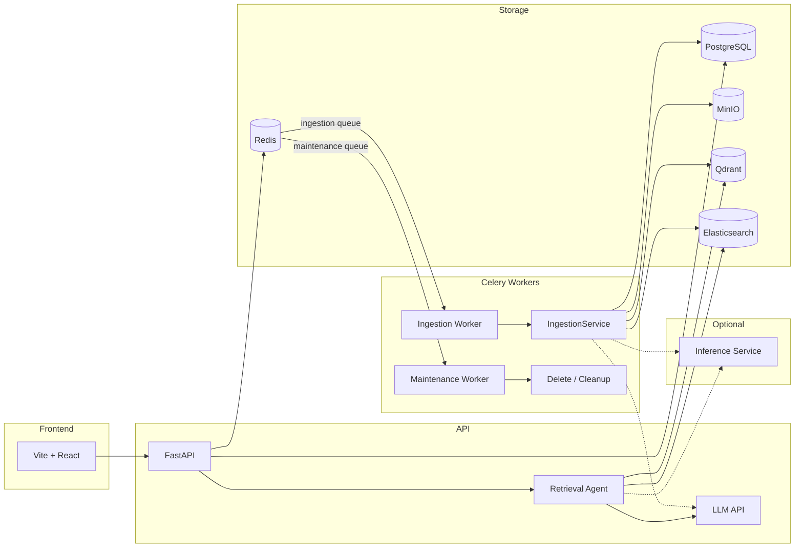
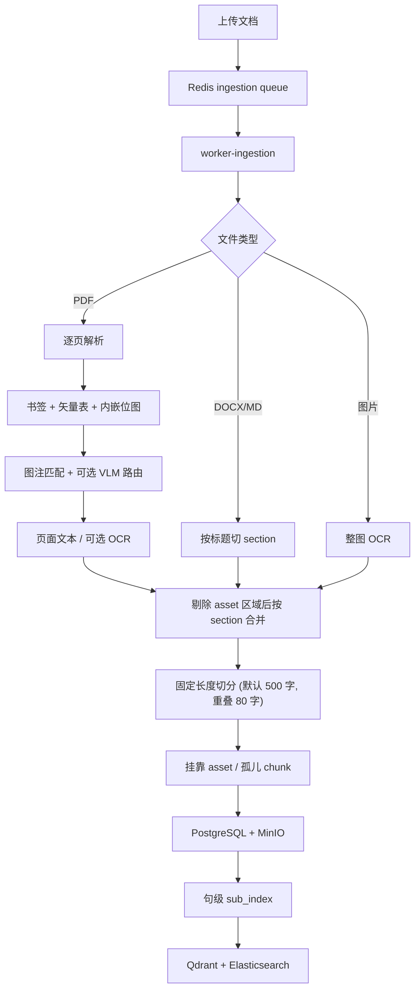

# AllDocs

面向操作指南、维修手册等文档的 **RAG 问答系统**：上传手册后，通过混合检索与 Agent 多步取证回答用户问题，支持引用来源、插图展示与语音交互。

---

## 功能概览

- 多格式文档上传与异步索引（PDF、Word、Markdown、图片等）
- PDF 书签章节、矢量表格、跨页表合并与内嵌插图解析
- 混合检索：Qdrant 向量 + Elasticsearch 全文（RRF 融合）+ Cross-encoder rerank
- Retrieval Agent：`list_documents`、`list_outline`、`lookup_toc`、`read_pages`、`read_section`、`lookup_asset`、`search_chunks` / `search_chunks_batch`、`search_keyword` 等工具多步检索
- 流式对话、引用跳转、解析期可选 VLM 对内嵌图分类描述（并辅助识别栅格表）与句级插图对齐
- WebSocket 语音问答（Whisper 转写 + Piper 合成）
- 用户认证与 RBAC：邮箱 / 手机 OTP / 微信登录，管理员与普通用户分权

---

## 架构



| 组件 | 作用 |
|------|------|
| **PostgreSQL** | 文档、chunk、asset、会话、消息、用户与运行时配置覆盖 |
| **MinIO** | 原始文件与表格/插图 PNG |
| **Qdrant** | chunk 向量（语义检索） |
| **Elasticsearch** | 正文与 caption 全文索引（IK 分词） |
| **Redis** | Celery 消息队列 |
| **Ingestion Worker** | 消费 `ingestion` 队列，执行文档解析（含可选 VLM 路由）、向量化与索引写入 |
| **Maintenance Worker** | 消费 `maintenance` 队列，执行删除与外部存储清理，避免被长时入库任务阻塞 |
| **Inference**（可选） | 独立 HTTP 服务承载 BGE embed / rerank，减轻 api/worker 内存 |

前后端共享契约位于 `backend/shared/`（`file_formats.json`、`markers.json`），由 Python `shared_contract.py` 与前端 `@shared` 别名共同引用。

---

## 快速开始

### 环境要求

- Docker Desktop（含 `docker compose`）
- Node.js 18+（仅开发模式本地前端）
- 可访问的 LLM API（在 `.env` 中配置 `LLM_API_KEY`）

### 开发模式

```bash
cp .env.example .env   # 编辑 LLM_API_KEY 等
./dev.sh               # Docker 后端 + 本地 Vite 前端
```

| 地址 | 说明 |
|------|------|
| http://localhost:3000 | 前端（Vite，`vite.config.ts` 固定端口） |
| http://localhost:8000 | API |
| http://localhost:8000/docs | OpenAPI 文档 |
| http://localhost:9001 | MinIO Console |

常用命令：

```bash
./dev.sh --build       # 重新构建镜像
./dev.sh --docker      # 生产 Compose（Nginx 前端，端口 3000）
./dev.sh --stop        # 停止所有 Docker 服务
docker compose logs -f api worker-ingestion worker-maintenance
```

可选：启用独立推理服务 offload embedding/rerank：

```bash
docker compose --profile inference up -d inference
# .env 中设置 INFERENCE_URL=http://inference:8100
```

首次启动会自动：从 `.env.example` 生成 `.env`、检查并下载 Embedding/Rerank 模型与 Piper 语音模型。

环境变量：`SKIP_PIPER=1`（跳过语音模型）、`SKIP_NPM_INSTALL=1`（跳过 `npm install`）、`USE_DOCKER_MIRROR=1`（镜像站拉取基础镜像）。

### 生产部署

阿里云 ECS 完整部署步骤（本地上传代码、初始化、`.env`、版本更新、HTTPS、运维与排障）见 **[docs/deploy-aliyun.md](docs/deploy-aliyun.md)**。

---

## 项目结构

```
AllDocs/
├── backend/
│   ├── app/
│   │   ├── api/              # documents, chat, assets, settings, auth, admin, ws_voice
│   │   ├── services/         # ingestion, rag, llm, vector_store, …
│   │   │   └── agent/        # Retrieval Agent、answer_flow、工具注册
│   │   ├── inference/        # 可选 BGE embed/rerank HTTP 服务
│   │   ├── workers/          # Celery 队列路由、入库/维护任务与请求上下文传递
│   │   └── observability.py  # JSON 日志、request/task 关联与 Prometheus 指标
│   ├── shared/               # 前后端共享契约（格式、标记正则）
│   └── tests/
├── frontend/src/             # Vite + React（citations、chatStream、MessageContent、SettingsPanel 等）
├── docker/                   # Elasticsearch 等镜像构建
├── docs/
│   └── manual-writing-guide.md   # 操作手册编写规范（面向文档作者）
├── scripts/                  # 模型下载、部署脚本
├── dev.sh                    # 一键开发启动
├── docker-compose.yml
└── .env.example
```

---

## 文档入库流程

上传后由 `worker-ingestion` 异步执行；删除任务由独立的 `worker-maintenance` 处理：

**解析（PDF 含矢量表/内嵌图提取与可选 VLM 路由）→ 切 chunk → 挂靠 asset → PostgreSQL + MinIO → 构建 sub_index → 向量化 → 混合索引**



### Asset 挂靠与 sub_index

解析完成后，表格/插图按以下顺序挂靠到正文 chunk（`pdf_refs.py`、`pdf_attach_reading_order.py`）：

1. **正文图号引用**：chunk 正文中的 forward ref（如 `（参考图 4-7）`）匹配 asset 的 `figure_number`
2. **图注反向匹配**：图注行解析出的 `figure_number` 与正文提及同一图号时挂靠
3. **阅读顺序兜底**：未配对的 asset 挂到同 section 内、最多回溯 **2 页** 的正文；同页取 asset **上方**最近正文（Y 坐标）
4. **孤儿 asset**：仍无法挂靠时生成仅含 asset 的独立 chunk

写入 PostgreSQL 后，Worker 为每个 chunk 构建 **`sub_index`**：按正文句内图号引用切分子句并关联 asset；无图号的 asset 按句间空隙启发式挂靠。问答合成时再以 embedding 余弦相似度把 asset 对齐到回答句子（见下方「回答合成」）。编写要求见 [手册编写规范 · 图注与图号](docs/manual-writing-guide.md#3-图注与图号最重要)。

### 支持格式

| 格式 | section 来源 |
|------|--------------|
| **PDF** | 书签（Bookmark / 大纲） |
| **DOCX** | Heading 1–6 段落样式；当前直接入库以标题和段落文本为主 |
| **Markdown** | `#` 标题行 |
| **TXT / HTML** | 无 section |
| **PNG / JPG / WEBP** | 无 section；整图 OCR |

PDF、图片和纯文本可在前端直接预览；DOCX 会在服务端转换为安全的自包含 HTML，HTML 文件则经过受限 iframe 展示。预览能力与入库能力不同：DOCX 预览可显示表格，但当前 DOCX 解析器不会把表格单元格或内嵌图片写入检索索引；含关键表格/插图的正式手册仍应导出为 PDF。详见 [手册编写规范 · 推荐格式](docs/manual-writing-guide.md#1-推荐格式)。

### Chunk 字段

| 字段 | 含义 |
|------|------|
| `text` | 正文（表格/插图区域内文字已剔除） |
| `page` | 页码（1 起） |
| `section` | 章节路径，如 `第一章 > 1.2 安装` |
| `chunk_index` | 文档内阅读顺序 |
| `caption` | chunk 级图像描述（可选，独立字段） |
| `layout_bbox` / `layout_regions` | 版面坐标，供文档查看器高亮 |
| `sub_index` | 句级子索引，关联句子与 asset（图号引用配对） |
| `assets` | 关联表格/插图（`ChunkAsset`，PNG 存 MinIO） |

Asset 级字段：`figure_number`（归一化图号，如 `4-7`）、`figure_caption`（图注行）、`caption`（矢量表摘要）、`vlm_caption`（VLM 描述）。上述 caption 字段不写入 `chunk.text`；向量化时通过 `chunk_embedding_text` 以 `[visual] …` 拼接到索引文本。

默认切分：`RAG_CHUNK_SIZE=500`、`RAG_CHUNK_OVERLAP=80`（见 `.env`）。

### PDF 处理要点

- **书签**：生成 `section` 与 `toc_entries`；同页多书签时依赖页内 **Y 坐标**切分（非 OCR 页）。书签目标应指向页内具体段落，避免仅绑定页码（见 [手册编写规范 · PDF 书签](docs/manual-writing-guide.md#4-pdf-书签)）
- **矢量表格**：`find_tables()` 整表提取为 `table` asset，摘要写入 `assets.caption`；跨页续表可合并（`pdf_table_merge.py`），PNG 可选纵向拼接（`PDF_STITCH_CROSS_PAGE_TABLE_PNG`）
- **内嵌位图**：提取为 `figure` asset；扫描整页图通常因面积过大被跳过
- **VLM 路由**（`INGEST_CAPTION_ENABLED`）：解析期内嵌位图经 VLM 分类（table/figure/diagram/photo）并生成 `vlm_caption`；判为表格时尝试 PPStructure 栅格表 OCR，成功则提升为 `table` asset（`pdf_vlm_route.py`、`table_ocr.py`）。受 `INGEST_CAPTION_MAX_PER_PAGE` 限制
- **前置页**：自动跳过「第一章」之前的封面/版权等（可调整书签规避）
- **目录页**：带点线引导符的目录样式页自动忽略
- **页眉页脚**：裁切上下边距区域，并剔除跨页重复的页眉页脚文本与页码（见 [手册编写规范](docs/manual-writing-guide.md)）

实现参考：`backend/app/services/ingestion.py`、`caption.py`、`pdf_captions.py`、`pdf_refs.py`、`pdf_attach_reading_order.py`、`asset_lookup.py`、`pdf_header_footer.py`、`pdf_tables.py`、`pdf_embedded_images.py`、`pdf_vlm_route.py`、`chunk_alignment.py`、`toc_lookup.py`、`fulltext_store.py`、`agent/`、`workers/tasks.py`。

---

## 问答检索

用户提问时，**Retrieval Agent** 多步调用工具收集证据，再流式合成回答。

### Agent 工具

| 工具 | 用途 |
|------|------|
| `list_documents` | 列出会话内文档（名称、页数、id、status） |
| `list_outline` | 列出文档章节树 |
| `lookup_toc` | 查询章节起止页码 |
| `read_pages` | 按页码读取页面内全部 chunk |
| `read_section` | 分页读取指定章节页码范围内的 chunk；截断时返回下一页 offset |
| `search_chunks` / `search_chunks_batch` | 混合检索；支持 `asset_types`、`section_prefix`、`section_contains`、`page_gte` / `page_lte` 等过滤 |
| `search_keyword` | 短语/关键词 BM25 全文检索（报警码、型号等） |
| `lookup_asset` | 按图号/表号精确查找插图或表格 |
| `read_neighbor_chunks` | 读取锚点 chunk 及相邻上下文（`chunk_id` 用检索结果中的 `id=` UUID，勿用 `[1][2]`） |
| `ask_user` | 信息不足时向用户澄清（仅问一点） |
| `finish` | 结束检索进入合成；可选 `key_evidence_ids` 标注最关键证据 |

常见意图 → 工具（详见 `llm.py` Agent 提示词）：

| 意图 | 推荐工具 | 勿用 |
|------|----------|------|
| 多文档消歧 | `list_documents` | `search_chunks` 猜文档 |
| 目录结构 | `list_outline` | `lookup_toc`（只需结构时） |
| 章节起止页码 | `lookup_toc` | `read_section`（只需页码时） |
| 已知页码读正文 | `read_pages` | `search_chunks` |
| 整章正文 | `read_section` | 逐条 `read_neighbor_chunks` |
| 图号/表号 | `lookup_asset` | 仅用 `search_chunks` |
| 报警码/型号 | `search_keyword` | `search_chunks`（精确词时） |
| 概念/步骤/原理 | `search_chunks` | 重复相同 query |
| 故障/报警/异常 | `search_chunks_batch` | 单路泛泛检索 |
| 参数规格表 | `search_chunks` + `asset_types=table` | — |
| snippet 截断/邻块延续 | `read_neighbor_chunks`（`id=` UUID） | `[1][2]` 序号 |

检索 observation 字段：`id=` chunk UUID；`score=` 相关度；`fig=` 图号；`idx=` 块序号；`search_chunks_batch` 跨路去重时重复项标 `dup@检索N`。

检索链路（按工具）：

| 工具 | 链路 |
|------|------|
| `search_chunks` / `search_chunks_batch` | Qdrant 向量 + Elasticsearch 全文（RRF）→ Cross-encoder rerank |
| `search_keyword` | Elasticsearch BM25 短语/精确词匹配（需 `HYBRID_ENABLED`；不走向量与 rerank） |
| `lookup_toc` / `read_section` | 书签目录匹配（`toc_lookup.py`）；`read_section` 再按起止页码 `read_pages` |
| `lookup_asset` | PostgreSQL 按 `figure_number` 精确查找 |
| `read_pages` / `read_neighbor_chunks` | PostgreSQL 按页码或 `chunk_index` 顺序读取 |

Agent 选取证据后进入 LLM 合成；`finish` 可选 `key_evidence_ids` 将关键 chunk 优先排序进 `<context>`。

同一步可并行调用多个互不依赖的工具（如 `search_chunks` + `read_neighbor_chunks`）；`finish` / `ask_user` 不得与其他工具同批。`search_chunks`、`search_chunks_batch`、`search_keyword` 均计入检索配额。历史步 tool observation 会压缩摘要（`observation_compress.py`），仅最近 `RAG_AGENT_KEEP_FULL_OBSERVATION_STEPS` 步保留完整结果；多步后会注入证据池索引供 Agent 复用已收集 chunk。

Agent 限制（`.env`）：`RAG_AGENT_MAX_STEPS=10`、`RAG_AGENT_MAX_RETRIEVALS=6`、`RAG_BATCH_SEARCH_MAX=3`、`RAG_AGENT_MAX_PARALLEL_TOOLS=4`、`RAG_AGENT_KEEP_FULL_OBSERVATION_STEPS=1`（默认，见 `config.py`）。

### 回答合成

`answer_flow.py` 统一 chat SSE 与语音 WebSocket 的流水线：

1. Agent 收集 `evidence[]`（或 `ask_user` 澄清 / 无证据 fallback）；`finish.key_evidence_ids` 指定的 chunk 优先进入上下文
2. `build_context()` 格式化为 `<context>` 注入 LLM
3. `chat_stream()` 流式生成带 `[n]` 引用的回答
4. `finalize_answer_async()`（`citations_util.py` → `answer_alignment.py`）：
   - 按首次出现重排 `[n]` 引用序号
   - 利用入库时写入的 `sub_index`，以 embedding 余弦相似度将 asset 对齐到回答句子（`sentence_index`，阈值 `RAG_STEP_ALIGN_MIN_SCORE`）
5. 回答已含 Markdown 表格时，可跳过邻近句的表格 PNG 展示（`EMBED_SKIP_TABLE_WHEN_ANSWER_HAS_MARKDOWN`）
6. 前端按 prose / embed 分段渲染（`MessageContent` + `ProseBlock`）；点击 `[n]` 跳转文档查看器并高亮 `layout_regions`

### Chat SSE 事件

`POST /api/v1/chat` 返回 `text/event-stream`，主要事件类型：

| 类型 | 说明 |
|------|------|
| `status` | 阶段提示（如 `agent`） |
| `agent_step_start` / `agent_thought_delta` / `agent_step` | Agent 推理步骤（前端展示检索过程） |
| `citations` | 证据来源列表（合成前） |
| `delta` | 回答文本增量 |
| `embeds` | 句级对齐后的插图/表格元数据 |
| `clarify` | Agent 请求用户澄清（`ask_user`） |
| `fallback` | 无证据时的兜底回复 |
| `done` | 完成（含 `session_id`、`content`、`citations`、`embeds`） |
| `error` | 异常信息 |

语音通道 `WebSocket /ws/voice` 复用同一 Agent 流水线，回答经 Piper TTS 按句输出。

---

## 用户认证与权限

默认启用 JWT 鉴权（`AUTH_DISABLED=false`）。开发/测试可设 `AUTH_DISABLED=true` 跳过校验（等价于内置 Admin 用户）。

### 角色

| 能力 | Admin | 普通用户 |
|------|-------|----------|
| 查看文档列表、预览、对话、语音 | ✅ | ✅ |
| 选择参与 RAG 的文档 | ✅ | ❌（自动使用全部 `ready` 文档） |
| 上传 / 重新索引 / 删除文档 | ✅ | ❌ |
| 管理（系统配置、用户管理、审计日志） | ✅ | ❌ |
| 账号面板（绑定 / 解绑登录方式） | ✅ | ✅ |

### 登录方式

| 方式 | 说明 |
|------|------|
| **邮箱** | 登录用密码；**注册**需邮箱验证码 + 设置密码 |
| **手机 OTP** | 验证码登录；未注册手机号验证通过后自动建号 |
| **微信 OAuth** | 扫码登录；未绑定账号自动注册 |

账号面板支持**绑定**额外登录方式；**解绑**时需至少保留一种（`DELETE /api/v1/auth/bind/{provider}`，`provider` 为 `email` | `phone` | `wechat`）。

### 首次管理员

在 `.env` 中配置：

```env
BOOTSTRAP_ADMIN_EMAIL=admin@example.com
BOOTSTRAP_ADMIN_PASSWORD=your-secure-password
```

API 启动时会自动创建该 Admin 账号（若邮箱尚未注册）。

也可手动创建：

```bash
docker compose exec api python -m app.cli create-admin --email admin@example.com
```

### 认证相关 API

| 方法 | 路径 | 说明 |
|------|------|------|
| POST | `/auth/register/email` | 邮箱注册（直接设密码，可选） |
| POST | `/auth/register/email-otp/send` | 发送邮箱注册验证码 |
| POST | `/auth/register/email-otp/verify` | 验证码注册并设置密码 |
| POST | `/auth/login/email` | 邮箱登录 |
| POST | `/auth/otp/send` | 发送手机验证码 |
| POST | `/auth/otp/verify` | 验证码登录 / 注册 |
| GET | `/auth/wechat/authorize` | 微信 OAuth 跳转 |
| GET | `/auth/wechat/callback` | 微信 OAuth 回调 |
| POST | `/auth/bind/email` | 绑定邮箱（需登录） |
| POST | `/auth/bind/otp/send` | 绑定手机：发送验证码 |
| POST | `/auth/bind/otp/verify` | 绑定手机：验证 |
| GET | `/auth/wechat/bind/authorize` | 绑定微信 |
| DELETE | `/auth/bind/{provider}` | 解绑登录方式 |
| POST | `/auth/refresh` | 刷新 access token |
| POST | `/auth/logout` | 注销 refresh token |
| GET | `/auth/me` | 当前用户信息 |
| GET | `/admin/users` | 用户列表（Admin） |
| PATCH | `/admin/users/{id}` | 修改角色 / 启用状态 / 昵称（Admin，写入审计日志） |
| GET | `/admin/audit-logs` | 审计日志（Admin） |

以上路径均带前缀 `/api/v1`。受保护接口需在请求头携带 `Authorization: Bearer <access_token>`；媒体资源 URL 亦支持 `?token=` 查询参数。

### 环境变量

| 变量 | 说明 |
|------|------|
| `JWT_SECRET` | 签名密钥（生产环境务必修改） |
| `JWT_ACCESS_TTL_MINUTES` / `JWT_REFRESH_TTL_DAYS` | Token 有效期 |
| `AUTH_DISABLED` | `true` 时跳过 JWT（仅开发/测试） |
| `BOOTSTRAP_ADMIN_EMAIL` / `BOOTSTRAP_ADMIN_PASSWORD` | 首次 Admin |
| `SMS_PROVIDER` | `console`（开发：验证码打日志）或 `aliyun` |
| `SMS_OTP_*` | 手机验证码 TTL、重发间隔、最大尝试次数 |
| `ALIYUN_SMS_*` | 阿里云短信 AccessKey、签名、模板等 |
| `EMAIL_PROVIDER` | `console`（开发：验证码打日志）或 `smtp` |
| `EMAIL_OTP_*` | 邮箱验证码 TTL、重发间隔、最大尝试次数 |
| `SMTP_*` | SMTP 发信（`EMAIL_PROVIDER=smtp` 时必填） |
| `WECHAT_APP_ID` / `WECHAT_APP_SECRET` / `WECHAT_REDIRECT_URI` | 微信开放平台 |
| `AUTH_FRONTEND_CALLBACK_URL` | OAuth 完成后前端回调地址 |

开发环境手机验证码：`SMS_PROVIDER=console`，在 API 日志中查看 OTP。邮箱注册验证码：`EMAIL_PROVIDER=console`，同样在 API 日志查看。生产环境设 `EMAIL_PROVIDER=smtp` 并填写 `SMTP_*`。

完整列表见 [`.env.example`](.env.example)。

---

## API 概览

业务 HTTP API 使用前缀 `/api/v1`；WebSocket、健康检查与指标端点位于根路径：

| 方法 | 路径 | 说明 |
|------|------|------|
| POST | `/documents` | 上传（同名文件触发重新索引） |
| GET | `/documents` | 文档列表 |
| GET | `/documents/formats` | 支持格式 |
| GET | `/documents/{id}/file` | 下载原文件 |
| GET | `/documents/{id}/preview` | DOCX / HTML 安全预览 HTML |
| GET | `/documents/{id}/pages/{page}/render` | 页面 PNG |
| POST | `/documents/{id}/reindex` | 重新入库 |
| DELETE | `/documents/{id}` | 异步删除 |
| POST | `/chat` | SSE 流式问答 |
| GET | `/assets/{asset_id}` | 表格/插图 PNG |
| GET | `/settings` | 可读运行时配置（含 `.env` 与数据库覆盖） |
| PATCH | `/settings` | 更新可编辑配置（持久化至 PostgreSQL，优先于 `.env`） |
| POST | `/auth/register/email` | 邮箱注册（见「用户认证与权限」） |
| POST | `/auth/login/email` | 邮箱登录 |
| GET | `/auth/me` | 当前用户 |
| GET | `/admin/users` | 用户管理（Admin） |
| GET | `/admin/audit-logs` | 审计日志（Admin） |
| WS | `/ws/voice` | 语音问答 |
| GET | `/health` | 健康检查 |
| GET | `/metrics` | Prometheus 指标（`METRICS_ENABLED=true` 时） |

文档状态：`pending` → `processing` → `ready` | `failed` | `deleting`。

---

## 配置说明

复制 `.env.example` 为 `.env`，主要配置组：

| 配置组 | 关键变量 |
|--------|----------|
| LLM | `LLM_API_BASE_URL`、`LLM_API_KEY`、`LLM_MODEL` |
| 入库 VLM | `INGEST_CAPTION_ENABLED`、`INGEST_CAPTION_*`（解析期内嵌图分类描述与栅格表识别，可选；未配置时回退 LLM 凭据） |
| Embedding / Rerank | `EMBEDDING_MODEL`、`RERANK_MODEL`、`RERANK_ENABLED` |
| 远程推理 | `INFERENCE_URL`（可选，见 `docker compose --profile inference`） |
| RAG / Agent | `RAG_CHUNK_SIZE`、`RAG_RETRIEVE_K`、`RAG_TOP_K`、`RAG_AGENT_*`、`RAG_STEP_ALIGN_MIN_SCORE`、`EMBED_SKIP_TABLE_*`、`HYBRID_ENABLED` |
| OCR / PDF | `OCR_*`、`PDF_EXTRACT_TABLES`、`PDF_EXTRACT_EMBEDDED_IMAGES`、`PDF_MERGE_CROSS_PAGE_TABLES`、`PDF_FILTER_HEADER_FOOTER`、`PDF_*_MARGIN_RATIO` |
| 基础设施 | `POSTGRES_URL`、`QDRANT_URL`、`ELASTICSEARCH_URL`、`MINIO_*` |
| 认证 | `JWT_*`、`AUTH_DISABLED`、`BOOTSTRAP_ADMIN_*`、`SMS_*`、`ALIYUN_SMS_*`、`WECHAT_*`、`AUTH_FRONTEND_CALLBACK_URL` |
| Worker | `CELERY_INGESTION_CONCURRENCY`、`CELERY_MAINTENANCE_CONCURRENCY` |
| 可观测性 | `LOG_LEVEL`、`METRICS_ENABLED`、`METRICS_WORKER_PORT` |

部分配置可通过前端设置面板或 `PATCH /api/v1/settings` 运行时覆盖（见 `settings_registry.py`），优先级高于 `.env`。

完整列表见 [`.env.example`](.env.example)。

API、Inference 与两个 Worker 均输出单行 JSON 日志。HTTP `request_id` 会通过 Celery header 传到任务日志，并与 `task_id` 一起用于排查跨服务请求；Prometheus 抓取地址及指标列表见 [可观测性说明](docs/observability.md)。

---

## 操作手册编写

上传文档的质量直接影响检索与问答效果。面向文档编写人员的规范见：

**[docs/manual-writing-guide.md](docs/manual-writing-guide.md)**

涵盖：图注与图号引用、PDF 书签、内容与排版要点及上传前检查清单。
