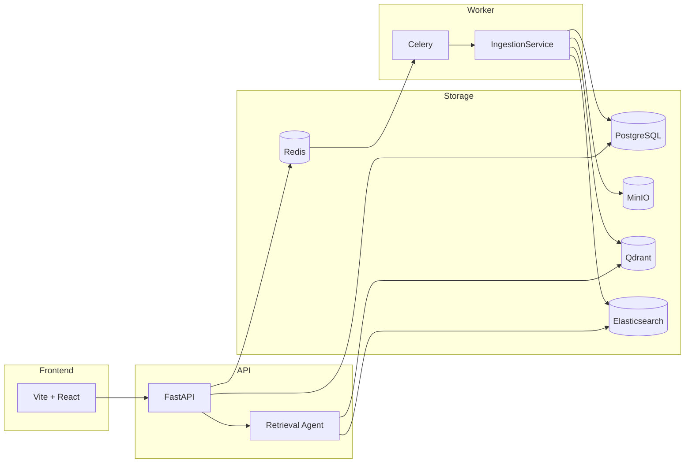
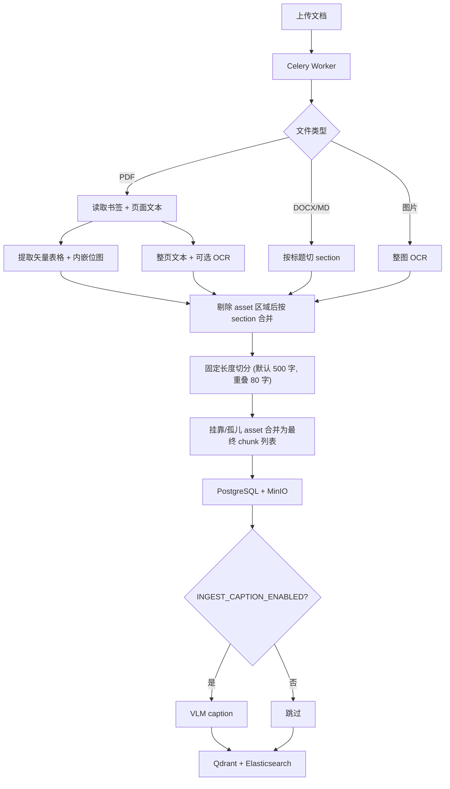

# AllDocs

面向操作指南、维修手册等文档的 **RAG 问答系统**：上传手册后，通过混合检索与 Agent 多步取证回答用户问题，支持引用来源、插图展示与语音交互。

---

## 功能概览

- 多格式文档上传与异步索引（PDF、Word、Markdown、图片等）
- PDF 书签章节、矢量表格与内嵌插图解析
- 混合检索：Qdrant 向量 + Elasticsearch 全文（RRF 融合）+ Cross-encoder rerank
- Retrieval Agent：`list_outline`、`lookup_toc`、`search_chunks`、`read_chunks` 等工具多步检索
- 流式对话、引用跳转、可选 Vision LLM 与 `{{embed:N}}` 插图嵌入
- WebSocket 语音问答（Whisper 转写 + Piper 合成）

---

## 架构



| 组件 | 作用 |
|------|------|
| **PostgreSQL** | 文档、chunk、asset、会话与消息 |
| **MinIO** | 原始文件与表格/插图 PNG |
| **Qdrant** | chunk 向量（语义检索） |
| **Elasticsearch** | 正文与 caption 全文索引（IK 分词） |
| **Redis** | Celery 消息队列 |
| **Celery Worker** | 文档解析、向量化、索引写入 |

---

## 快速开始

### 环境要求

- Docker Desktop（含 `docker compose`）
- Node.js 18+（仅开发模式本地前端）
- 可访问的 LLM API（在 `.env` 中配置 `LLM_API_KEY`）

### 开发模式

```bash
cp .env.example .env   # 编辑 LLM_API_KEY 等
./dev.sh               # Docker 后端 + 本地 Vite 前端
```

| 地址 | 说明 |
|------|------|
| http://localhost:5173 | 前端（Vite 默认端口，以终端输出为准） |
| http://localhost:8000 | API |
| http://localhost:8000/docs | OpenAPI 文档 |
| http://localhost:9001 | MinIO Console |

常用命令：

```bash
./dev.sh --build       # 重新构建镜像
./dev.sh --docker      # 生产 Compose（Nginx 前端，端口 3000）
./dev.sh --stop        # 停止所有 Docker 服务
docker compose logs -f api worker
```

首次启动会自动：从 `.env.example` 生成 `.env`、检查并下载 Embedding/Rerank 模型与 Piper 语音模型。

---

## 项目结构

```
AllDocs/
├── backend/app/          # FastAPI 应用、入库、RAG、Agent
│   ├── api/              # documents, chat, assets, ws_voice
│   ├── services/         # ingestion, rag, llm, vector_store, …
│   └── workers/          # Celery 任务
├── frontend/             # Vite + React 前端
├── docker/               # Elasticsearch 等镜像构建
├── docs/
│   └── manual-writing-guide.md   # 操作手册编写规范（面向文档作者）
├── scripts/              # 模型下载、部署脚本
├── dev.sh                # 一键开发启动
├── docker-compose.yml
└── .env.example
```

---

## 文档入库流程

上传后由 Celery Worker 异步执行：

**解析 → 切 chunk → 上传 asset →（可选）VLM caption → 向量化 → 混合索引 → 入库**



### 支持格式

| 格式 | section 来源 |
|------|--------------|
| **PDF** | 书签（Bookmark / 大纲） |
| **DOCX** | Heading 1–6 段落样式 |
| **Markdown** | `#` 标题行 |
| **TXT / HTML** | 无 section |
| **PNG / JPG / WEBP** | 无 section；整图 OCR |

### Chunk 字段

| 字段 | 含义 |
|------|------|
| `text` | 正文（表格/插图区域内文字已剔除） |
| `page` | 页码（1 起） |
| `section` | 章节路径，如 `第一章 > 1.2 安装` |
| `chunk_index` | 文档内阅读顺序 |
| `caption` | chunk 级图像描述（可选，独立字段） |
| `assets` | 关联表格/插图（`ChunkAsset`，PNG 存 MinIO） |

`caption` 与 `assets[].caption` 不写入 `chunk.text`；向量化时通过 `chunk_embedding_text` 以 `[visual] …` 拼接到索引文本。

默认切分：`RAG_CHUNK_SIZE=500`、`RAG_CHUNK_OVERLAP=80`（见 `.env`）。

### PDF 处理要点

- **书签**：生成 `section` 与 `toc_entries`；同页多书签时依赖页内 **Y 坐标**切分（非 OCR 页）。书签目标应指向页内具体段落，避免仅绑定页码（见 [手册编写规范 · PDF 书签](docs/manual-writing-guide.md)）
- **矢量表格**：`find_tables()` 整表提取为 `table` asset，摘要写入 `assets.caption`
- **内嵌位图**：提取为 `figure` asset；扫描整页图通常因面积过大被跳过
- **前置页**：自动跳过「第一章」之前的封面/版权等（可调整书签规避）
- **目录页**：带点线引导符的目录样式页自动忽略
- **页眉页脚**：裁切上下边距区域，并剔除跨页重复的页眉页脚文本与页码（见 [手册编写规范 · 页眉页脚](docs/manual-writing-guide.md#35-页眉与页脚)）

实现参考：`backend/app/services/ingestion.py`、`pdf_header_footer.py`、`pdf_tables.py`、`pdf_embedded_images.py`、`workers/tasks.py`。

---

## 问答检索

用户提问时，**Retrieval Agent** 多步调用工具收集证据，再流式合成回答。

| 工具 | 用途 |
|------|------|
| `list_outline` | 列出文档章节树 |
| `lookup_toc` | 查询章节起止页码 |
| `search_chunks` / `search_chunks_batch` | 混合检索；支持 `asset_types`、`section_prefix`、`page_gte` 等过滤 |
| `read_chunks` / `read_neighbor_chunks` | 精读 chunk 及相邻上下文 |
| `finish` | 结束检索进入合成 |

检索链路：**Qdrant + Elasticsearch（RRF）→ rerank → Agent 选取证据 → LLM 合成**。

---

## 配置说明

复制 `.env.example` 为 `.env`，主要配置组：

| 配置组 | 关键变量 |
|--------|----------|
| LLM | `LLM_API_BASE_URL`、`LLM_API_KEY`、`LLM_MODEL` |
| 入库 Caption | `INGEST_CAPTION_ENABLED`、`INGEST_CAPTION_*`（入库 VLM 描述，可选） |
| Embedding / Rerank | `EMBEDDING_MODEL`、`RERANK_MODEL`、`RERANK_ENABLED` |
| 远程推理 | `INFERENCE_URL`（可选，见 `docker compose --profile inference`） |
| RAG | `RAG_CHUNK_SIZE`、`RAG_RETRIEVE_K`、`RAG_TOP_K`、`HYBRID_ENABLED` |
| OCR / PDF | `OCR_*`、`PDF_EXTRACT_TABLES`、`PDF_EXTRACT_EMBEDDED_IMAGES`、`PDF_FILTER_HEADER_FOOTER`、`PDF_*_MARGIN_RATIO` |
| 基础设施 | `POSTGRES_URL`、`QDRANT_URL`、`ELASTICSEARCH_URL`、`MINIO_*` |

完整列表见 [`.env.example`](.env.example)。

---

## 操作手册编写

上传文档的质量直接影响检索与问答效果。面向文档编写人员的规范见：

**[docs/manual-writing-guide.md](docs/manual-writing-guide.md)**

涵盖：文字与图片分工、表格排版、PDF 书签、Word/Markdown 标题、扫描件注意事项及上传前检查清单。
