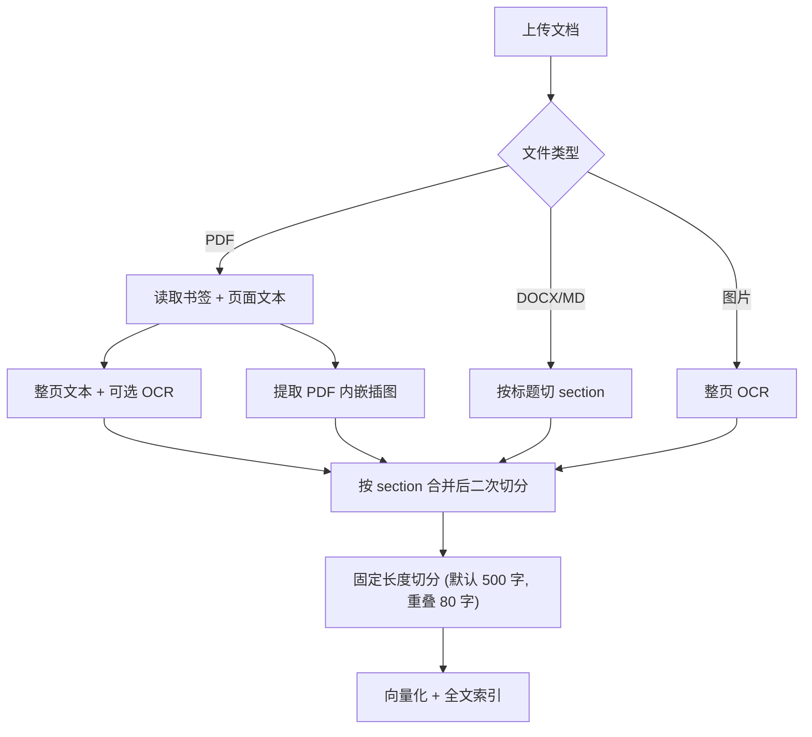

# 操作手册标注指南

本文档面向**准备上传至 AllDocs 的操作指南、维修手册**的标注人员，说明系统如何切分文本块（chunk），以及如何通过 PDF 书签等方式获得更好的检索与问答效果。

---

## 1. 系统如何处理文档

上传后，系统会依次完成：**解析 → 切 chunk →（可选）生成图像描述 → 向量化 → 入库**。

每个 chunk 会携带以下元数据，供检索与引用：


| 字段           | 含义                    | 来源                          |
| ------------ | --------------------- | --------------------------- |
| `text`       | 正文内容                  | 页面文本 / OCR                  |
| `page`       | 页码（1 起）               | PDF 页序                      |
| `section`    | 章节路径，如 `第一章 > 1.2 安装` | 书签层级                        |
| `caption`    | 图像描述（可选，已合并进 text）   | VLM 生成，需开启配置                |
| `assets`     | 表格/图示 PNG（可选）            | PDF 内嵌位图提取                  |





**默认切分参数**（可在 `.env` 调整）：

- `RAG_CHUNK_SIZE=500`：同一 section 内连续正文超过 500 字符会再切分
- `RAG_CHUNK_OVERLAP=80`：相邻 chunk 保留约 80 字符重叠，避免句意被截断

向量化时，会把 `section` 拼在正文前面，例如：

```
第一章 > 1.2 安装
将设备放置在平稳台面上……
```

因此**章节标注是否准确，直接影响检索命中率**。

---

## 2. 支持格式与 section 来源


| 格式                   | section 如何产生          |
| -------------------- | --------------------- |
| **PDF**              | 书签（Bookmark / 大纲）     |
| **DOCX**             | 段落样式为 Heading 1–6 的标题 |
| **Markdown (.md)**   | `#` 标题行               |
| **TXT / HTML**       | 无 section（整篇一个块）      |
| **PNG / JPG / WEBP** | 无 section；整图 OCR      |


**推荐**：需要精细章节检索的正式手册，优先使用 **带书签的 PDF**。

---

## 3. PDF 书签（Bookmark）标注规范

书签用于生成 `section` 字段，并支持 Agent 的目录查询（`list_outline` / `lookup_toc`）。

### 3.1 层级结构

- 使用 PDF 阅读器或排版工具中的**大纲 / 书签**功能，不要用纯视觉标题代替。
- 层级应反映文档结构，例如：
  - 1 级：章（`第一章 概述`）
  - 2 级：节（`1.1 产品简介`）
  - 3 级：小节（`1.1.1 适用范围`）
- 系统会把路径拼成：`第一章 概述 > 1.1 产品简介 > 1.1.1 适用范围`（最长 512 字符）。

### 3.2 页内 Y 坐标切分（同一页多个书签）

若**多个书签指向同一页**，系统会读取 bookmark 的**页内垂直位置**，按文本块中心高度判断所属 section，而不是整页只归一个章节。

**最佳实践：**

- 每个小节的书签应落在**该小节标题或正文起始行**附近，不要都堆在页面顶部。
- 同级小节尽量**从不同页开始**；若必须在同页，务必保证 bookmark 的 Y 坐标能区分上下内容。
- 用 Adobe Acrobat、Foxit 等工具设置书签时，确保「目标位置」指向正确段落（会写入 `dest.to` 坐标）。

**避免：**

- 多个同级书签全部指向同一页且 Y 坐标相同或缺失 → 无法页内区分，会退回「整页一个 section」。
- 书签标题与正文标题不一致 → 检索时 section 名称对用户不直观。

### 3.3 前置页自动跳过

存在书签时，系统会尝试定位**第一章起始页**，并**跳过之前的前置内容**（封面、版权、目录等），规则如下：

1. 标题或路径匹配「第一章 / Chapter 1」等；
2. 否则取第一个 1 级书签；
3. 再否则取最早的书签页。

若希望保留前置页内容，需调整书签结构（例如不设「第一章」前的独立 1 级项，或把封面也纳入正式章节）。

### 3.4 目录页自动忽略

若某一页文本被识别为**目录样式**（带点线引导符 + 页码的多行列表，且匹配行占比 ≥ 40%），该页不会入库。无需手动删除目录页，但应保证正文页不像目录格式。

---

## 4. PDF 表格

系统用 PyMuPDF `find_tables()` 识别 PDF 中的**矢量表格**，整张表作为 **table asset** 处理，**不会**把表格文字拆进普通 text chunk。

流程：

1. 提取表格区域并渲染为 PNG asset
2. 从页面正文中**剔除**表格区域内的文字，避免重复入库
3. 优先挂到同页最近的 text chunk；表格摘要存在 `assets.caption`，检索/向量化时再与正文拼接
4. 若附近没有可挂靠文字：单独建 text chunk（正文为空），表格摘要只在 asset caption 里

相关配置（`.env`）：

| 配置项 | 默认值 | 含义 |
|--------|--------|------|
| `PDF_EXTRACT_TABLES` | `true` | 是否提取 PDF 表格 |
| `PDF_TABLE_MIN_ROWS` | `2` | 最少行数 |
| `PDF_TABLE_MIN_COLS` | `2` | 最少列数 |
| `PDF_TABLE_RENDER_SCALE` | `2.0` | 表格渲染清晰度 |

**说明：**

- 扫描件 / OCR 页上的表格通常无法被 `find_tables` 识别，仍靠 OCR 文字入库。
- 参数类问题可用 Agent 过滤 `filters.asset_types: ["table"]` 优先命中带表格 asset 的 chunk。

---

## 5. PDF 内嵌插图

系统会自动从 PDF 页面中提取**内嵌位图**（非矢量绘制的 JPEG/PNG 等对象），存为 `figure` 类型 asset，并关联到同页附近的 text chunk。图示区域内的文字会从 host chunk 正文中剔除；描述存在 `assets.caption`（图区 OCR 或 VLM），检索时再与正文拼接。

相关配置（`.env`）：

| 配置项 | 默认值 | 含义 |
|--------|--------|------|
| `PDF_EXTRACT_EMBEDDED_IMAGES` | `true` | 是否提取内嵌插图 |
| `PDF_EMBEDDED_IMAGE_MIN_WIDTH` | `64` | 最小宽度（像素） |
| `PDF_EMBEDDED_IMAGE_MIN_HEIGHT` | `64` | 最小高度（像素） |
| `PDF_EMBEDDED_IMAGE_MAX_PAGE_COVERAGE` | `0.85` | 单图占页面积超过此比例则跳过（扫描整页图通常被过滤） |
| `PDF_EMBEDDED_IMAGE_MAX_PER_PAGE` | `20` | 每页最多提取数量 |

**说明：**

- 纯扫描 PDF（每页一张整页位图）通常因面积过大**不会**成为 asset；文字仍靠 OCR 入库。
- 回答中展示插图需命中带 `figure` asset 的 text chunk，且与问题相关；详见 `LLM_VISION_ENABLED` 配置。
- 系统**不再**读取 PDF 高亮/批注来识别表格或图片。

---

## 6. OCR 与扫描件


| 配置项                      | 默认值     | 含义                 |
| ------------------------ | ------- | ------------------ |
| `OCR_ENABLED`            | `true`  | 启用 OCR             |
| `OCR_MIN_CHARS_PER_PAGE` | `30`    | 原生文本少于此字符数时触发 OCR  |
| `OCR_FORCE`              | `false` | 为 `true` 时每页强制 OCR |


**注意：**

- OCR 页**没有块级坐标**，无法做书签 Y 坐标页内切分，整页使用一个 section。
- 扫描件仍建议补全书签，至少保证**页级** section 正确。
- 纯图片文件（PNG/JPG 等）走整图 OCR，无 section。

---

## 7. 非 PDF 格式标注要点

### Word（.docx）

- 章节标题请使用内置样式 **「标题 1」「标题 2」…**（Heading 1–6），不要用仅加粗的大号正文模拟标题。
- 系统按标题切换 section，再在 section 内按 500 字切分。

### Markdown（.md）

- 使用 `#` ~ `######` 标题语法划分 section。
- 纯 `.txt` 不按标题切分。

### HTML

- 剥除标签后作为整篇正文，无 section。

---

## 8. 可选增强能力

以下能力需在 `.env` 中开启，**不改变 chunk 切分规则**，但影响检索与回答质量。


| 配置                            | 作用                                   |
| ----------------------------- | ------------------------------------ |
| `INGEST_CAPTION_ENABLED=true` | 入库时用 VLM 为插图或短文本页生成 `caption`，写入向量 |
| `LLM_VISION_ENABLED=true`     | 回答时可结合插图，并插入 `{{embed:N}}` 展示原图 |


`caption` 会附加在向量文本末尾，格式为 `[visual] 描述内容`，对图文并茂页面有帮助。

---

## 9. 上传前检查清单

**结构**

- [ ] PDF 已设置完整书签层级，标题与正文一致
- [ ] 同页多个小节时，书签目标位置落在对应段落（非全部堆在页顶）
- [ ] 第一章书签页码正确，避免误跳过有效正文

**内容质量**

- [ ] 正文为可选中文本层（非纯扫描）或扫描质量可 OCR
- [ ] 目录页无需手动删除（系统自动识别跳过）
- [ ] 修改书签或文档后已**重新上传或触发重新索引**

---

## 10. 常见问题

**Q：同一页两个 section 内容混在一个 chunk 里？**  
A：多为书签 Y 坐标相同或缺失。在 PDF 编辑器中重新设置书签目标到各小节标题行。

**Q：section 显示为 `None`？**  
A：文档无书签，或非 PDF 的 TXT/HTML；或内容位于「第一章」之前的被跳过页。

**Q：回答里看不到插图？**  
A：需证据中命中带 `figure` asset 的 text chunk，且与问题相关；可开启 `LLM_VISION_ENABLED`。扫描整页 PDF 通常无裁剪 asset。

**Q：chunk 太长 / 太短？**  
A：section 内会按 `RAG_CHUNK_SIZE` 二次切分；调大该值可减少碎片，调小则更精细。

---

## 11. 快速参考卡片

```
PDF 正式手册
├── 书签 → section（章节路径）
│   └── 同页多节 → 依赖书签 Y 坐标
├── 矢量表格 → assets.type=table（整表不切开，挂到 text chunk）
├── 内嵌位图 → assets.type=figure（挂到 text chunk，扫描整页通常跳过）
└── 正文 / OCR → text chunk

DOCX / MD → 标题样式 / # 标题 → section
扫描 PDF  → OCR，仅页级 section
```

---

*文档版本随 AllDocs 入库逻辑更新；若行为与本文不符，以 `backend/app/services/ingestion.py` 与 `pdf_embedded_images.py` 实现为准。*
