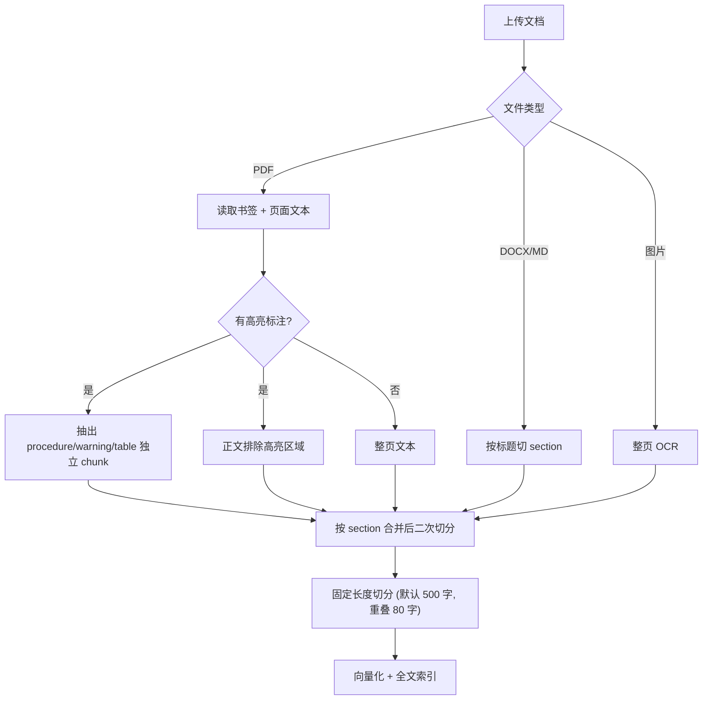

# 操作手册标注指南

本文档面向**准备上传至 AllDocs 的说明书、维修手册、操作指南**的标注人员，说明系统如何切分文本块（chunk），以及如何通过 PDF 书签、高亮标注等方式获得更好的检索与问答效果。

---

## 1. 系统如何处理文档

上传后，系统会依次完成：**解析 → 切 chunk →（可选）生成图像描述 → 向量化 → 入库**。

每个 chunk 会携带以下元数据，供检索与引用：


| 字段           | 含义                                              | 来源                |
| ------------ | ----------------------------------------------- | ----------------- |
| `text`       | 正文内容                                            | 页面文本 / 高亮区域 OCR   |
| `page`       | 页码（1 起）                                         | PDF 页序            |
| `section`    | 章节路径，如 `第一章 > 1.2 安装`                           | 书签层级              |
| `chunk_type` | 内容类型：`text` / `procedure` / `warning` / `table` | 默认 `text`；高亮标注可指定 |
| `caption`    | 图像描述（可选）                                        | VLM 生成，需开启配置      |
| `assets`     | 裁剪图（目前主要为 `table`）                              | 高亮区域截图            |





**默认切分参数**（可在 `.env` 调整）：

- `RAG_CHUNK_SIZE=500`：同一 section 内连续正文超过 500 字符会再切分
- `RAG_CHUNK_OVERLAP=80`：相邻 chunk 保留约 80 字符重叠，避免句意被截断

向量化时，会把 `section` 拼在正文前面，例如：

```
第一章 > 1.2 安装
将设备放置在平稳台面上……
```

因此**章节标注是否准确，直接影响检索命中率**。

---

## 2. 支持格式与 section 来源


| 格式                   | section 如何产生          | 类型标注   |
| -------------------- | --------------------- | ------ |
| **PDF**              | 书签（Bookmark / 大纲）     | 支持高亮标注 |
| **DOCX**             | 段落样式为 Heading 1–6 的标题 | 不支持    |
| **Markdown (.md)**   | `#` 标题行               | 不支持    |
| **TXT / HTML**       | 无 section（整篇一个块）      | 不支持    |
| **PNG / JPG / WEBP** | 无 section；整图 OCR      | 不支持    |


**推荐**：需要精细章节与步骤/表格检索的正式手册，优先使用 **带书签 + 高亮标注的 PDF**。

---

## 3. PDF 书签（Bookmark）标注规范

书签用于生成 `section` 字段，并支持 Agent 的目录查询（`list_outline` / `lookup_toc`）。

### 3.1 层级结构

- 使用 PDF 阅读器或排版工具中的**大纲 / 书签**功能，不要用纯视觉标题代替。
- 层级应反映文档结构，例如：
  - 1 级：章（`第一章 概述`）
  - 2 级：节（`1.1 产品简介`）
  - 3 级：小节（`1.1.1 适用范围`）
- 系统会把路径拼成：`第一章 概述 > 1.1 产品简介 > 1.1.1 适用范围`（最长 512 字符）。

### 3.2 页内 Y 坐标切分（同一页多个书签）

若**多个书签指向同一页**，系统会读取 bookmark 的**页内垂直位置**，按文本块中心高度判断所属 section，而不是整页只归一个章节。

**最佳实践：**

- 每个小节的书签应落在**该小节标题或正文起始行**附近，不要都堆在页面顶部。
- 同级小节尽量**从不同页开始**；若必须在同页，务必保证 bookmark 的 Y 坐标能区分上下内容。
- 用 Adobe Acrobat、Foxit 等工具设置书签时，确保「目标位置」指向正确段落（会写入 `dest.to` 坐标）。

**避免：**

- 多个同级书签全部指向同一页且 Y 坐标相同或缺失 → 无法页内区分，会退回「整页一个 section」。
- 书签标题与正文标题不一致 → 检索时 section 名称对用户不直观。

### 3.3 前置页自动跳过

存在书签时，系统会尝试定位**第一章起始页**，并**跳过之前的前置内容**（封面、版权、目录等），规则如下：

1. 标题或路径匹配「第一章 / Chapter 1」等；
2. 否则取第一个 1 级书签；
3. 再否则取最早的书签页。

若希望保留前置页内容，需调整书签结构（例如不设「第一章」前的独立 1 级项，或把封面也纳入正式章节）。

### 3.4 目录页自动忽略

若某一页文本被识别为**目录样式**（带点线引导符 + 页码的多行列表，且匹配行占比 ≥ 40%），该页不会入库。无需手动删除目录页，但应保证正文页不像目录格式。

---

## 4. PDF 高亮类型标注规范

高亮标注用于生成 `**procedure` / `warning` / `table`** 类型的独立 chunk。Agent 在回答「操作步骤」「参数规格」等问题时，会优先按 `chunk_type` 过滤检索。

### 4.1 支持的批注类型

以下 PDF 批注均有效：

- **高亮**（Highlight）
- **文本注释**（Text）
- **自由文本**（FreeText）

### 4.2 如何指定类型

在批注的以下字段之一写入类型关键字（中英文均可，不区分大小写）：


| 写入字段             | 说明                  |
| ---------------- | ------------------- |
| **主题 / Subject** | 推荐，Acrobat 批注属性中最常用 |
| **标题 / Title**   | 备选                  |
| **内容 / Content** | 备选                  |
| **名称 / Name**    | 备选                  |


**类型关键字对照表：**


| 目标类型        | 可填关键字                              | 用途                      |
| ----------- | ---------------------------------- | ----------------------- |
| `procedure` | `procedure`、`步骤`、`step`、`steps`    | 操作步骤、拆装流程               |
| `warning`   | `warning`、`警告`、`注意`、`危险`、`caution` | 安全警示、注意事项               |
| `table`     | `table`、`表格`                       | 参数表、规格表、对照表             |
| `text`      | `text`、`正文`                        | **不生成独立 chunk**（与未标注相同） |


关键字可包含在更长句子中（如「注意：高压危险」会识别为 `warning`）。

### 4.3 标注操作要点

1. **框选范围**：高亮区域应完整覆盖目标段落或表格，系统会提取区域内的文本。
2. **与正文关系**：被标注区域会从普通正文 chunk 中**排除**，避免同一段文字重复入库。
3. **section 归属**：按高亮区域在页内的垂直中心，结合书签计算 `section`。
4. **表格额外处理**：`table` 类型会额外裁剪区域 PNG 存为资产，便于问答时展示原表（需开启视觉能力）。
5. **一页多处**：按页内从上到下顺序，与正文 chunk 交错排列。

### 4.4 推荐标注场景


| 内容             | 建议类型        | 说明              |
| -------------- | ----------- | --------------- |
| 安装 / 调试步骤列表    | `procedure` | 便于「怎么操作」类问题精准召回 |
| 红色警示框、安全须知     | `warning`   | 便于故障排查时附带安全提示   |
| 额定参数、接线表、故障代码表 | `table`     | 便于参数类问题 + 原表展示  |
| 普通说明段落         | 不标注         | 保持默认 `text`     |


---

## 5. OCR 与扫描件


| 配置项                      | 默认值     | 含义                 |
| ------------------------ | ------- | ------------------ |
| `OCR_ENABLED`            | `true`  | 启用 OCR             |
| `OCR_MIN_CHARS_PER_PAGE` | `30`    | 原生文本少于此字符数时触发 OCR  |
| `OCR_FORCE`              | `false` | 为 `true` 时每页强制 OCR |


**注意：**

- OCR 页**没有块级坐标**，无法做书签 Y 坐标页内切分，整页使用一个 section。
- 扫描件仍建议补全书签，至少保证**页级** section 正确。
- 纯图片文件（PNG/JPG 等）走整图 OCR，无 section、无类型标注。

---

## 6. 非 PDF 格式标注要点

### Word（.docx）

- 章节标题请使用内置样式 **「标题 1」「标题 2」…**（Heading 1–6），不要用仅加粗的大号正文模拟标题。
- 系统按标题切换 section，再在 section 内按 500 字切分。

### Markdown（.md）

- 使用 `#` ~ `######` 标题语法划分 section。
- 纯 `.txt` 不按标题切分。

### HTML

- 剥除标签后作为整篇正文，无 section。

---

## 7. 可选增强能力

以下能力需在 `.env` 中开启，**不改变 chunk 切分规则**，但影响检索与回答质量。


| 配置                            | 作用                                   |
| ----------------------------- | ------------------------------------ |
| `INGEST_CAPTION_ENABLED=true` | 入库时用 VLM 为表格截图或短文本页生成 `caption`，写入向量 |
| `LLM_VISION_ENABLED=true`     | 回答时可结合页面/表格图片，并插入 `{{embed:N}}` 展示原图 |


`caption` 会附加在向量文本末尾，格式为 `[visual] 描述内容`，对图文并茂页面有帮助。

---

## 8. 上传前检查清单

**结构**

- [ ] PDF 已设置完整书签层级，标题与正文一致
- [ ] 同页多个小节时，书签目标位置落在对应段落（非全部堆在页顶）
- [ ] 第一章书签页码正确，避免误跳过有效正文

**类型标注（PDF）**

- [ ] 操作步骤已用高亮标注，Subject 含 `procedure` 或 `步骤`
- [ ] 安全警示已标注，Subject 含 `warning` / `注意` / `危险`
- [ ] 参数表已标注，Subject 含 `table` 或 `表格`，且框选完整

**内容质量**

- [ ] 正文为可选中文本层（非纯扫描）或扫描质量可 OCR
- [ ] 目录页无需手动删除（系统自动识别跳过）
- [ ] 修改标注后已**重新上传或触发重新索引**

---

## 9. 常见问题

**Q：标注了高亮，但 Agent 仍检索不到步骤？**  
A：检查 Subject 是否含有效关键字；关键字是否为 `text`/`正文`（会被忽略）；是否已重新处理文档。

**Q：同一页两个 section 内容混在一个 chunk 里？**  
A：多为书签 Y 坐标相同或缺失。在 PDF 编辑器中重新设置书签目标到各小节标题行。

**Q：section 显示为 `None`？**  
A：文档无书签，或非 PDF 的 TXT/HTML；或内容位于「第一章」之前的被跳过页。

**Q：表格能检索但回答里看不到原表？**  
A：需 `table` 高亮标注 + 开启 `LLM_VISION_ENABLED`；且 Agent 需在证据中命中该 chunk。

**Q：chunk 太长 / 太短？**  
A：section 内会按 `RAG_CHUNK_SIZE` 二次切分；调大该值可减少碎片，调小则更精细。

---

## 10. 快速参考卡片

```
PDF 正式手册
├── 书签 → section（章节路径）
│   └── 同页多节 → 依赖书签 Y 坐标
├── 高亮批注 → chunk_type
│   ├── procedure / 步骤  → 操作步骤
│   ├── warning / 注意    → 安全警示
│   └── table / 表格      → 参数表 (+ 截图)
└── 无标注正文            → text（默认）

DOCX / MD → 标题样式 / # 标题 → section
扫描 PDF  → OCR，仅页级 section
```

---

*文档版本随 AllDocs 入库逻辑更新；若行为与本文不符，以 `backend/app/services/ingestion.py` 与 `type_annotations.py` 实现为准。*